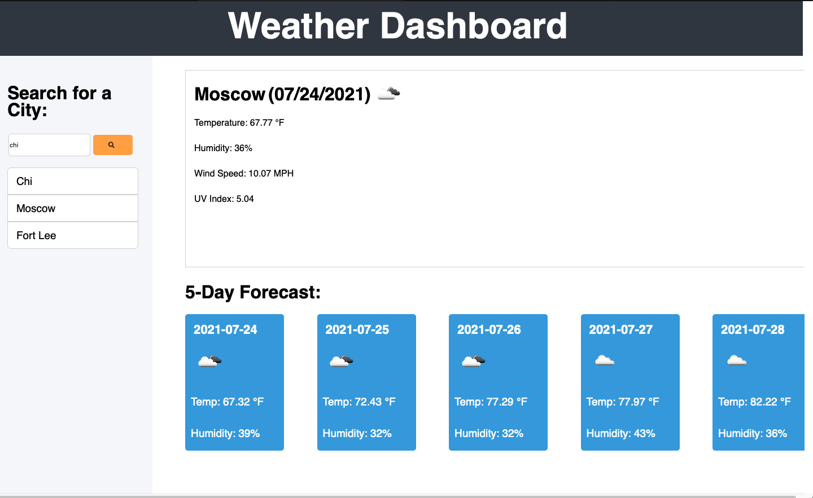

# Weather-Dashbaord
## Project Description
Our assignment was to create a weather dashboard that leverage a 3rd party server api to propigate our web application with relevant data. The site should be working and deployed, and all the information on the site is source directly from a reliable weather source via their API.

To use the application, please enter a valid city into the search bar located at the top-left of the page. Once you'r desired city is found, please press the yellow magnifiying glass (search button).

## Contents
1. [Deployed Page](#deployed-page)
2. [Project Comments](#refactor-comments)
3. [Contributions](#contributions)

## Deployed Page

[Deployed GitPage](https://michaeladamgroberman.github.io/Weather-Dashbaord/)

## Project Comments
* Really wanted to, but had to need to use flex.
* Very easy considering we are leveraging api.

## Contributions
* Project completed by Michael Groberman
* API Documentation and Access provided by the openweathermap.org